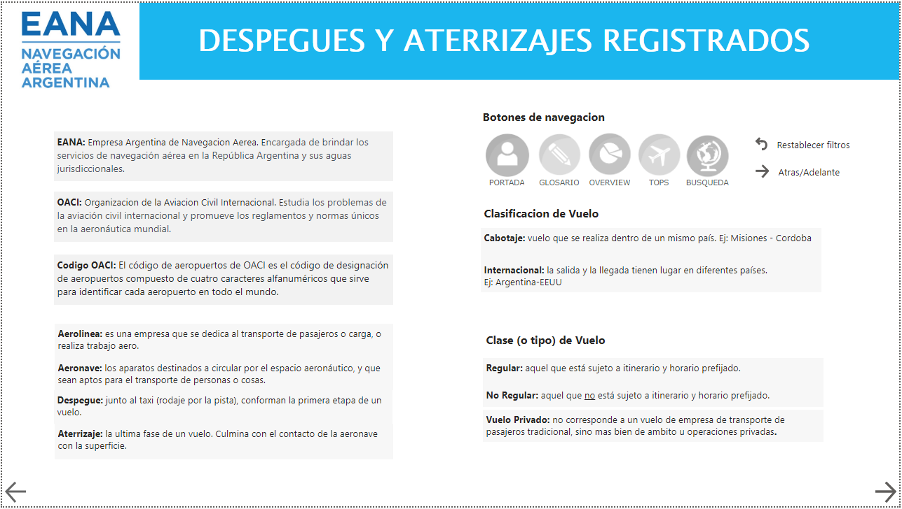

# Registros EANA 2017-2020

## Objetivo
El siguiente proyecto tiene como objetivo obtener un análisis general de las operaciones aeronáuticas que tuvieron comienzo o fin en el territorio de la Republica Argentina.

## Alcance
A lo largo de las páginas del tablero se espera que el usuario pueda apreciar en gráficos y números el tráfico de operaciones (de despegues y aterrizajes), las aerolíneas que operaron, aviones utilizados, y los aeropuertos que tienen como lugar de origen o destino.
Acorde a los elementos antes mencionados, podemos ver como estos se ven alterados según horario del día, por día o mes, y especialmente por año. Abarca desde 2017 hasta el 2020 con la llegada de la pandemia, la cual afecto enormemente la industria aeronáutica.

## Usuario Final
El trabajo y el uso del tablero va dirigido a todo aquel usuario interesado en la aeronáutica que quiera o requiera información acerca de los vuelos realizados dentro de los plazos que los datos utilizados abarcan, desde 2017 hasta 2020.

## Formato
El tablero y toda la información que el usuario podrá apreciar está en idioma español. Se utilizaron colores claros para los fondos, y una paleta de colores comprendida entre celestes, azules, morados, lilas y amarillos.

## Paginas

## Fuente de los archivos utilizados

Registros EANA:
https://datos.gob.ar/ar/dataset/transporte-aterrizajes-despegues-registrados-por-empresa-argentina-navegacion-aerea-eana

airports.JSON:
https://gist.github.com/tdreyno/4278655

Iconos de la portada:
https://www.freepik.com/makyzz

#
La documentacion completa se encuentra subida en pdf, donde se detalla como esta conformado el tablero, su analisis funcional, la transformacion de datos, futuras lineas, etc.
